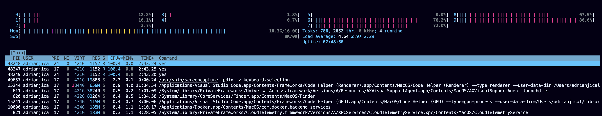
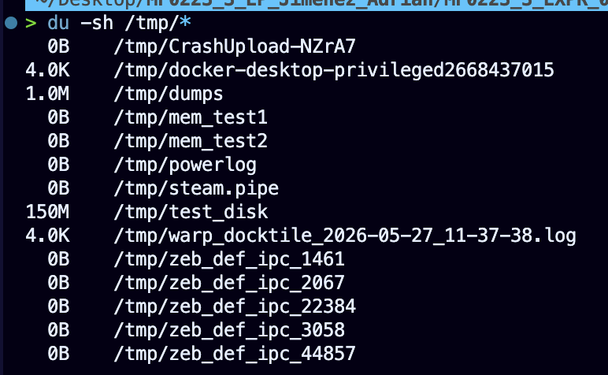
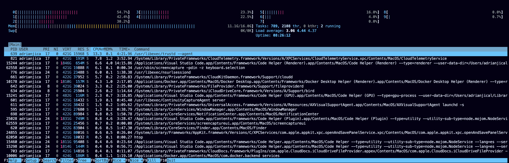

# Ejercicio 3

## Ejecutamos el script

Como de inicio no tenemos los permisos necesarios para ejecutarlo, nos damos permisos:

```bash
chmod 777 script.sh
```

Ejecutamos el script:

```bash
./script.sh
```

## Análisis de CPU

Ejecutamos htop:

```bash
htop
```

Nos da el siguiente resultado:



Vemos que hay 3 procesos llamados 'yes' que nos estan consumiendo mucha CPU, son nuestros principales sospechosos.

Con htop podemos ver que hay una columna que se llama MEM%, podemos obserbar que los sospechosos no estan utilizando memoria.
Destruimos los procesos desde htop colocandonos encima del proceso y clickando F9.

Al ejecutar ```bash du -sh /tmp/*``` vemos que /tmp/test_disk es la que mas ocupa.



Si nos fijamos en el script da la instrucción de crear 3 procesos llamados 'yes' y de crear una carpeta llamada /tmp/test_disk y crea una ejecución que no se ve ni hace nada, solo consume recursos.

Con esto hemos identificado al sospechoso principal que era el script.sh.

## Solución

Antes hemos detenido los procesos problematicos de yes, ahora solo tendríamos que eliminar la carpeta y el archivo malicioso.

```bash
rm -rf /tmp/test_disk script.sh
```

Comprobamos que el sistema ha vuelto a la normalidad con htop.



Vemos que ya no esta el proceso 'yes'.
Salimos de htop con q.
